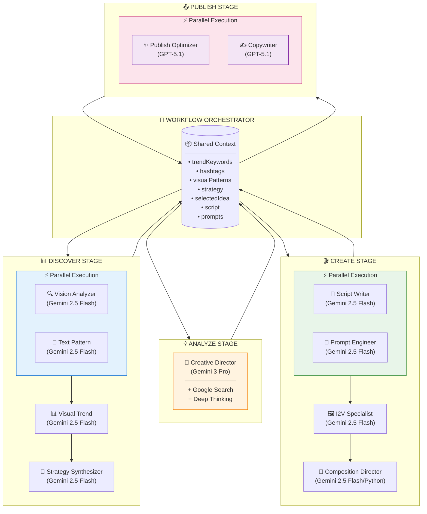

# HYBE Hydra - AI Agent Architecture Plan

> **Created**: 2024-12-06
> **Status**: Approved for Implementation
> **Related**: [AI_LLM_USAGE_ANALYSIS.md](./AI_LLM_USAGE_ANALYSIS.md)

---

## 1. Executive Summary

### 목표
- 11개 분산된 AI 서비스를 독립적인 Agent로 재구성
- 모델별 특장점을 활용한 최적 모델 할당
- 중앙 Orchestrator를 통한 유기적 데이터 흐름 관리
- 프롬프트 중앙화 및 재사용성 향상

### 모델 전략
| Category | Model | 용도 |
|----------|-------|------|
| Analysis/Transform | `gemini-2.5-flash` | 빠른 분석, 패턴 인식, 구조화 출력 |
| Strategic Thinking | `gemini-3-pro-preview` | 깊은 추론, 전략적 의사결정 |
| User-Facing Text | `gpt-5.1` | 자연스러운 카피라이팅, 엔게이지먼트 최적화 |

---

## 2. Model Selection Rationale

### 2.1 Gemini 2.5 Flash
**사용처**: Analyzer, Transformer Agents

**특장점**:
- 빠른 응답 속도 (latency 최적화)
- 구조화된 JSON 출력 우수
- Vision 멀티모달 지원
- 패턴 인식 및 분석 우수
- 비용 효율적

**할당 Agents**:
- Vision Analyzer Agent
- Text Pattern Agent
- Visual Trend Agent
- Strategy Synthesizer Agent
- Script Writer Agent
- Prompt Engineer Agent
- I2V Specialist Agent
- Composition Director Agent

---

### 2.2 Gemini 3 Pro Preview
**사용처**: Creative Director Agent (유지)

**특장점**:
- 깊은 추론 능력 (ThinkingLevel: HIGH)
- 복잡한 전략적 분석
- 다중 요소 의사결정
- Google Search 연동 (실시간 정보)
- 창의적 아이디어 생성

**할당 Agents**:
- Creative Director Agent

---

### 2.3 GPT-5.1
**사용처**: Publisher Agents

**특장점**:
- 자연스러운 문장 생성
- 창의적 카피라이팅 우수
- 톤/보이스 조절 탁월
- 이모지/해시태그 센스
- 엔게이지먼트 최적화
- Adaptive Reasoning 지원

**Model ID**: `gpt-5.1`

**할당 Agents**:
- Publish Optimizer Agent
- Copywriter Agent

**참고**: [OpenAI GPT-5.1 공식 문서](https://platform.openai.com/docs/models/gpt-5.1)

---

## 3. Agent Architecture

### 3.1 Agent 분류

```
┌─────────────────────────────────────────────────────────────────────────────────┐
│                           AGENT ARCHITECTURE                                     │
├─────────────────────────────────────────────────────────────────────────────────┤
│                                                                                 │
│  ┌───────────────────────────────────────────────────────────────────────────┐ │
│  │                      🎯 WORKFLOW ORCHESTRATOR                              │ │
│  │  • 워크플로우 라우팅  • 컨텍스트 집계  • 에이전트 조율  • 결과 병합        │ │
│  └───────────────────────────────────────────────────────────────────────────┘ │
│                                      │                                         │
│      ┌───────────────────────────────┼───────────────────────────┐            │
│      ▼                               ▼                           ▼            │
│  ┌─────────────────┐    ┌─────────────────────┐    ┌─────────────────┐        │
│  │  ANALYZER POOL  │    │   CREATOR POOL      │    │ PUBLISHER POOL  │        │
│  │  ───────────────│    │   ─────────────     │    │ ───────────────│        │
│  │  Gemini 2.5     │    │   Gemini 2.5/3 Pro  │    │ GPT-5.1        │        │
│  │                 │    │                     │    │                 │        │
│  │  • Vision       │    │  • Creative Dir     │    │ • Publish Opt   │        │
│  │  • Text Pattern │    │  • Script Writer    │    │ • Copywriter    │        │
│  │  • Visual Trend │    │  • Prompt Engineer  │    │                 │        │
│  │  • Strategy Syn │    │  • I2V Specialist   │    │                 │        │
│  │                 │    │  • Composition Dir  │    │                 │        │
│  └─────────────────┘    └─────────────────────┘    └─────────────────┘        │
│                                                                                 │
└─────────────────────────────────────────────────────────────────────────────────┘
```

### 3.2 Agent 상세 정의

#### ANALYZER AGENTS (Gemini 2.5 Flash)

| Agent | ID | 역할 | Input | Output |
|-------|-----|------|-------|--------|
| Vision Analyzer | `vision-analyzer` | 이미지/영상 시각 요소 분석 | media (base64/URL) | style, mood, colors, motion suggestion |
| Text Pattern | `text-pattern` | 해시태그/텍스트 패턴 분석 | hashtags[], texts[] | clusters, sentiment, themes |
| Visual Trend | `visual-trend` | 시각 트렌드 패턴 종합 | videoAnalyses[] | dominant styles, prompt templates |
| Strategy Synthesizer | `strategy-synthesizer` | 통합 콘텐츠 전략 도출 | textAnalysis, visualAnalysis | unified strategy, guidelines |

#### CREATOR AGENTS

| Agent | ID | Model | 역할 | Input | Output |
|-------|-----|-------|------|-------|--------|
| Creative Director | `creative-director` | Gemini 3 Pro | 전략적 아이디어 생성 | userIdea, strategy, audience | ideas[], prompts, strategy |
| Script Writer | `script-writer` | Gemini 2.5 Flash | 영상 스크립트 작성 | concept, vibe, keywords | script lines, timing, BPM |

#### TRANSFORMER AGENTS (Gemini 2.5 Flash)

| Agent | ID | 역할 | Input | Output |
|-------|-----|------|-------|--------|
| Prompt Engineer | `prompt-engineer` | VEO 프롬프트 최적화 | rawPrompt, style | optimizedPrompt, safetyScore |
| I2V Specialist | `i2v-specialist` | I2V 프롬프트 생성 | imageAnalysis, scene | image/video/background prompts |
| Composition Director | `composition-director` | 슬라이드쇼 구성 연출 | images, lyrics, audio | CompositionPlan |

#### PUBLISHER AGENTS (GPT-5.1)

| Agent | ID | 역할 | Input | Output |
|-------|-----|------|-------|--------|
| Publish Optimizer | `publish-optimizer` | 발행 최적화 제안 | context (all stages) | caption, hashtags, tips |
| Copywriter | `copywriter` | SEO 카피라이팅 | video desc, artist, mood | caption, hashtags, seoScore |

---

## 4. Agent Interface Design

### 4.1 Type Definitions

```typescript
// lib/agents/types.ts

export interface AgentConfig {
  id: string;
  name: string;
  description: string;
  category: 'analyzer' | 'creator' | 'transformer' | 'publisher';

  model: {
    provider: 'gemini' | 'openai';
    name: string;  // 'gemini-2.5-flash' | 'gemini-3-pro-preview' | 'gpt-5.1'
    options?: {
      temperature?: number;
      maxTokens?: number;
      tools?: Tool[];
      reasoningEffort?: 'none' | 'low' | 'medium' | 'high';  // GPT-5.1
      thinkingLevel?: 'LOW' | 'MEDIUM' | 'HIGH';  // Gemini 3 Pro
    };
  };

  prompts: {
    system: string;
    templates: Record<string, string>;
  };

  inputSchema: ZodSchema;
  outputSchema: ZodSchema;
  dependencies?: string[];
}

export interface AgentContext {
  discover?: {
    trendKeywords: string[];
    hashtags: string[];
    visualPatterns: VisualPattern[];
    contentStrategy: ContentStrategy;
  };
  analyze?: {
    selectedIdea: ContentIdea;
    optimizedPrompt: string;
    suggestedMusic: MusicSuggestion;
  };
  create?: {
    script: ScriptLine[];
    veoPrompt: string;
    searchKeywords: string[];
  };
  workflow: {
    campaignId: string;
    artistName: string;
    language: 'ko' | 'en';
    platform: 'tiktok' | 'instagram' | 'youtube';
  };
}

export interface AgentResult<T> {
  success: boolean;
  data?: T;
  error?: string;
  metadata: {
    agentId: string;
    model: string;
    tokenUsage: { input: number; output: number };
    latencyMs: number;
  };
}
```

### 4.2 Base Agent Class

```typescript
// lib/agents/base-agent.ts

import { AgentConfig, AgentContext, AgentResult } from './types';
import { GeminiClient } from '../models/gemini-client';
import { OpenAIClient } from '../models/openai-client';

export abstract class BaseAgent<TInput, TOutput> {
  protected config: AgentConfig;
  protected modelClient: GeminiClient | OpenAIClient;

  constructor(config: AgentConfig) {
    this.config = config;
    this.modelClient = this.initializeClient();
  }

  private initializeClient() {
    if (this.config.model.provider === 'gemini') {
      return new GeminiClient({
        model: this.config.model.name,
        ...this.config.model.options
      });
    } else {
      return new OpenAIClient({
        model: this.config.model.name,
        ...this.config.model.options
      });
    }
  }

  async execute(
    input: TInput,
    context: AgentContext
  ): Promise<AgentResult<TOutput>> {
    const startTime = Date.now();

    try {
      // 1. Validate input
      const validatedInput = this.config.inputSchema.parse(input);

      // 2. Build prompt with context
      const prompt = this.buildPrompt(validatedInput, context);

      // 3. Execute model
      const response = await this.modelClient.generate({
        system: this.config.prompts.system,
        user: prompt
      });

      // 4. Parse and validate output
      const output = this.config.outputSchema.parse(
        this.parseResponse(response)
      );

      return {
        success: true,
        data: output,
        metadata: {
          agentId: this.config.id,
          model: this.config.model.name,
          tokenUsage: response.usage,
          latencyMs: Date.now() - startTime,
        },
      };
    } catch (error) {
      return {
        success: false,
        error: error instanceof Error ? error.message : 'Unknown error',
        metadata: {
          agentId: this.config.id,
          model: this.config.model.name,
          tokenUsage: { input: 0, output: 0 },
          latencyMs: Date.now() - startTime,
        },
      };
    }
  }

  protected abstract buildPrompt(input: TInput, context: AgentContext): string;
  protected abstract parseResponse(response: ModelResponse): TOutput;
}
```

---

## 5. Agent Configurations

### 5.1 Vision Analyzer Agent

```typescript
// lib/agents/analyzers/vision-analyzer.ts

export const VisionAnalyzerAgent: AgentConfig = {
  id: 'vision-analyzer',
  name: 'Vision Analyzer Agent',
  description: '이미지/영상의 시각적 요소를 분석하여 스타일, 무드, 색상 등 추출',
  category: 'analyzer',

  model: {
    provider: 'gemini',
    name: 'gemini-2.5-flash',
    options: { temperature: 0.3 }
  },

  prompts: {
    system: `You are a visual content analyst specializing in social media aesthetics.
Analyze visual content with precision and consistency.
Always respond in valid JSON format.`,

    templates: {
      image: `Analyze this image for content creation:
{
  "style_analysis": {
    "visual_style": "aesthetic description",
    "color_palette": ["hex colors"],
    "lighting": "lighting style",
    "mood": "emotional tone",
    "composition": "composition style"
  },
  "content_analysis": {
    "main_subject": "primary focus",
    "setting": "environment",
    "props": ["notable objects"]
  },
  "technical": {
    "brightness": 0.0-1.0,
    "complexity": 0.0-1.0,
    "suggested_motion": "zoom_in|zoom_out|pan_left|pan_right|static"
  }
}`,
      video: `Analyze this video content for style extraction...`
    }
  },

  inputSchema: z.object({
    mediaType: z.enum(['image', 'video']),
    mediaData: z.string(),
    analysisDepth: z.enum(['quick', 'detailed']).default('detailed')
  }),

  outputSchema: z.object({
    style_analysis: z.object({
      visual_style: z.string(),
      color_palette: z.array(z.string()),
      lighting: z.string(),
      mood: z.string(),
      composition: z.string()
    }),
    content_analysis: z.object({
      main_subject: z.string(),
      setting: z.string(),
      props: z.array(z.string())
    }),
    technical: z.object({
      brightness: z.number(),
      complexity: z.number(),
      suggested_motion: z.string()
    })
  })
};
```

### 5.2 Text Pattern Agent

```typescript
// lib/agents/analyzers/text-pattern.ts

export const TextPatternAgent: AgentConfig = {
  id: 'text-pattern',
  name: 'Text Pattern Agent',
  description: '해시태그, 캡션, 텍스트 트렌드의 패턴과 감성 분석',
  category: 'analyzer',

  model: {
    provider: 'gemini',
    name: 'gemini-2.5-flash',
    options: { temperature: 0.3 }
  },

  prompts: {
    system: `You are a social media text analyst.
Identify patterns, clusters, and sentiment in text data.
Focus on actionable insights for content creation.`,

    templates: {
      clusterHashtags: `Group these hashtags into meaningful clusters:
{{hashtags}}

Return JSON:
{
  "clusters": [
    {
      "name": "cluster theme",
      "hashtags": ["tag1", "tag2"],
      "avgEngagement": number,
      "trendDirection": "rising|stable|declining"
    }
  ],
  "outliers": ["unclustered tags"]
}`,

      analyzeSentiment: `Analyze sentiment of these texts:
{{texts}}

Return: { "overall": "positive|neutral|negative", "score": -1 to 1, "emotions": [] }`,

      generateCaptionTemplates: `Based on trending patterns:
{{patterns}}

Generate 5 viral caption templates with {{placeholders}}.`
    }
  }
};
```

### 5.3 Visual Trend Agent

```typescript
// lib/agents/analyzers/visual-trend.ts

export const VisualTrendAgent: AgentConfig = {
  id: 'visual-trend',
  name: 'Visual Trend Agent',
  description: '다수의 영상 분석 결과를 종합하여 시각적 트렌드 패턴 도출',
  category: 'analyzer',

  model: {
    provider: 'gemini',
    name: 'gemini-2.5-flash',
    options: { temperature: 0.4 }
  },

  prompts: {
    system: `You are a visual trend analyst for social media content.
Aggregate individual video analyses into trend patterns.
Identify what visual styles are performing well.`,

    templates: {
      aggregatePatterns: `Aggregate these video analysis results into trend patterns:
{{videoAnalyses}}

Return:
{
  "dominantStyles": [{ "style": "", "frequency": 0.0, "avgEngagement": 0 }],
  "colorTrends": [{ "palette": [], "usage": 0.0 }],
  "paceDistribution": { "slow": 0.0, "medium": 0.0, "fast": 0.0 },
  "effectsTrending": ["effect1", "effect2"],
  "promptTemplates": [
    {
      "template": "A prompt template capturing this trend...",
      "style": "style name",
      "confidence": 0.0-1.0
    }
  ]
}`
    }
  },

  dependencies: ['vision-analyzer']
};
```

### 5.4 Strategy Synthesizer Agent

```typescript
// lib/agents/analyzers/strategy-synthesizer.ts

export const StrategySynthesizerAgent: AgentConfig = {
  id: 'strategy-synthesizer',
  name: 'Strategy Synthesizer Agent',
  description: '텍스트 + 시각 트렌드를 종합하여 통합 콘텐츠 전략 도출',
  category: 'analyzer',

  model: {
    provider: 'gemini',
    name: 'gemini-2.5-flash',
    options: { temperature: 0.5 }
  },

  prompts: {
    system: `You are a content strategist synthesizing multi-modal trend data.
Create actionable content strategies from text and visual trend analyses.
Balance creativity with data-driven insights.`,

    templates: {
      synthesize: `Synthesize these trend analyses into a unified strategy:

TEXT TRENDS:
{{textAnalysis}}

VISUAL TRENDS:
{{visualAnalysis}}

PERFORMANCE BENCHMARKS:
{{benchmarks}}

Return comprehensive strategy:
{
  "contentThemes": [{ "theme": "", "priority": 1-5, "rationale": "" }],
  "visualGuidelines": {
    "styles": [],
    "colors": [],
    "pace": "",
    "effects": []
  },
  "captionGuidelines": {
    "hooks": [],
    "ctas": [],
    "hashtags": []
  },
  "bestPractices": [],
  "avoid": [],
  "confidenceScore": 0.0-1.0
}`
    }
  },

  dependencies: ['text-pattern', 'visual-trend']
};
```

### 5.5 Creative Director Agent (Gemini 3 Pro)

```typescript
// lib/agents/creators/creative-director.ts

export const CreativeDirectorAgent: AgentConfig = {
  id: 'creative-director',
  name: 'Creative Director Agent',
  description: '전략적 콘텐츠 아이디어 생성 및 VEO 프롬프트 기획',
  category: 'creator',

  model: {
    provider: 'gemini',
    name: 'gemini-3-pro-preview',  // 유지 - 전략적 사고 필요
    options: {
      temperature: 0.7,
      tools: [{ googleSearch: {} }],
      thinkingLevel: 'HIGH'
    }
  },

  prompts: {
    system: `You are a creative director for viral social media content.
Generate innovative content ideas backed by trend data and strategic thinking.
Each idea must include a complete VEO-optimized prompt (200+ words).
Think deeply about what makes content go viral.`,

    templates: {
      generateIdeas: `Based on trend strategy and user input, generate 3-4 content ideas:

USER CONCEPT: {{userIdea}}
TREND STRATEGY: {{strategy}}
TARGET AUDIENCE: {{audience}}
CONTENT GOALS: {{goals}}
PERFORMANCE BENCHMARKS: {{benchmarks}}

For each idea provide:
{
  "ideas": [{
    "title": "catchy title (max 50 chars)",
    "hook": "opening hook (max 100 chars)",
    "description": "2-3 sentence concept",
    "estimatedEngagement": "high|medium|low",
    "optimizedPrompt": "Detailed VEO prompt (200+ words) with:
      - Subject description
      - Environment/setting
      - Lighting conditions
      - Camera movements
      - Mood/atmosphere
      - Style references",
    "suggestedMusic": { "bpm": 100, "genre": "genre" },
    "scriptOutline": ["scene1", "scene2", ...]
  }],
  "optimizedHashtags": [],
  "contentStrategy": "overall approach"
}`
    }
  },

  dependencies: ['strategy-synthesizer']
};
```

### 5.6 Script Writer Agent

```typescript
// lib/agents/creators/script-writer.ts

export const ScriptWriterAgent: AgentConfig = {
  id: 'script-writer',
  name: 'Script Writer Agent',
  description: '영상 스크립트 생성 및 타이밍 설계',
  category: 'creator',

  model: {
    provider: 'gemini',
    name: 'gemini-2.5-flash',
    options: {
      temperature: 0.6,
      tools: [{ google_search: {} }]
    }
  },

  prompts: {
    system: `You are a TikTok script writer specializing in short-form viral content.
Create scripts with perfect timing and hook-first structure.
Every script MUST start with a curiosity-inducing hook.`,

    templates: {
      generateScript: `Generate a {{duration}}s video script:

ARTIST: {{artistName}}
CONCEPT: {{concept}}
VIBE: {{vibe}}
TREND KEYWORDS: {{keywords}}
LANGUAGE: {{language}}

Script structure (5-8 lines):
1. HOOK (2-4 words, curiosity-inducing)
2. Setup
3. Build
4. Climax
5. CTA

Hook examples: "Wait for it...", "POV:", "Nobody expected this", "The moment when..."

Return:
{
  "script": {
    "lines": [
      { "text": "", "timing": 0, "duration": 2, "purpose": "hook|setup|build|climax|cta" }
    ],
    "totalDuration": {{duration}}
  },
  "vibe": "Exciting|Emotional|Pop|Minimal",
  "vibeReason": "",
  "suggestedBpmRange": { "min": 100, "max": 120 },
  "searchKeywords": ["8-10 keywords for image search"],
  "effectRecommendation": "zoom_beat|crossfade|bounce|minimal"
}`
    }
  }
};
```

### 5.7 Prompt Engineer Agent

```typescript
// lib/agents/transformers/prompt-engineer.ts

export const PromptEngineerAgent: AgentConfig = {
  id: 'prompt-engineer',
  name: 'Prompt Engineer Agent',
  description: 'VEO 최적화 프롬프트 변환 및 안전성 검증',
  category: 'transformer',

  model: {
    provider: 'gemini',
    name: 'gemini-2.5-flash',
    options: { temperature: 0.5 }
  },

  prompts: {
    system: `You are the Hydra Prompt Alchemist.
Transform user inputs into VEO-optimized, brand-safe video prompts.

## HYBE Cinematic Formula (always include):
1. SUBJECT: Clear main focus
2. ENVIRONMENT: Detailed setting
3. LIGHTING: Specific conditions
4. CAMERA: Movement and framing
5. MOOD: Emotional atmosphere

## Safety Rules:
- NO violence, weapons, harmful content
- NO explicit or suggestive content
- NO real celebrity names (replace with descriptors like "a stylish person")
- NO controversial political/religious content
- Maintain HYBE premium brand image`,

    templates: {
      transform: `Transform this prompt for VEO:
INPUT: {{rawPrompt}}
STYLE: {{style}}
DURATION: {{duration}}s

Apply HYBE Cinematic Formula.
Sanitize any celebrity names.

Return:
{
  "optimizedPrompt": "Full VEO prompt following HYBE Cinematic Formula...",
  "safetyScore": 0.0-1.0,
  "sanitizedNames": [{"original": "", "replacement": ""}],
  "warnings": [],
  "cinematicBreakdown": {
    "subject": "",
    "environment": "",
    "lighting": "",
    "camera": "",
    "mood": ""
  }
}`
    }
  }
};
```

### 5.8 I2V Specialist Agent

```typescript
// lib/agents/transformers/i2v-specialist.ts

export const I2VSpecialistAgent: AgentConfig = {
  id: 'i2v-specialist',
  name: 'I2V Specialist Agent',
  description: 'Image-to-Video 워크플로우용 프롬프트 생성',
  category: 'transformer',

  model: {
    provider: 'gemini',
    name: 'gemini-2.5-flash',
    options: { temperature: 0.5 }
  },

  prompts: {
    system: `You specialize in Image-to-Video prompt engineering.
Create prompts that bring still images to life with natural motion.
Maintain visual consistency between source image and video.`,

    templates: {
      imagePrompt: `Create FLUX image prompt from scene:
SCENE: {{sceneDescription}}
STYLE: {{style}}

Focus on: composition, lighting, mood, subject positioning
The image will be the first frame for video generation.

Return detailed prompt for FLUX image generation.`,

      videoPrompt: `Create video prompt from image analysis:
IMAGE ANALYSIS: {{imageAnalysis}}
SCENE: {{sceneDescription}}
DURATION: {{duration}}s
STYLE: {{style}}

Describe smooth camera movements and natural motion.
Maintain visual consistency with the source image.

Return VEO-optimized video prompt.`,

      backgroundPrompt: `Create background prompt:
SUBJECT: {{subject}}
STYLE: {{style}}
MOOD: {{mood}}

Background should complement without competing for attention.
Return FLUX-optimized background prompt.`
    }
  }
};
```

### 5.9 Composition Director Agent (Python)

```python
# backend/compose-engine/app/agents/composition_director.py

COMPOSITION_DIRECTOR_CONFIG = {
    "id": "composition-director",
    "name": "Composition Director Agent",
    "description": "슬라이드쇼 영상의 전체 구성 연출",
    "category": "transformer",

    "model": {
        "provider": "gemini",
        "name": "gemini-2.5-flash",
        "options": {"temperature": 0.7}
    },

    "prompts": {
        "system": """You are an expert video editor and composer.
Create cohesive, emotionally engaging slideshow compositions.
Match transitions to energy, time captions to music, maintain visual rhythm.""",

        "templates": {
            "analyzeImage": """Analyze this image for video composition:
{
    "description": "Brief description",
    "mood": "energetic|calm|emotional|dramatic|happy|sad|mysterious|romantic|powerful",
    "dominant_colors": ["color1", "color2"],
    "has_person": true/false,
    "has_text": true/false,
    "brightness": 0.0-1.0,
    "complexity": 0.0-1.0,
    "suggested_motion": "zoom_in|zoom_out|pan_left|pan_right|static"
}""",

            "analyzeLyrics": """Analyze these lyrics/captions for video composition:
{
    "mood": "Overall emotional mood",
    "themes": ["theme1", "theme2"],
    "emotional_arc": "Description of emotional progression",
    "language": "detected language code",
    "key_moments": [{"line_index": 0, "emotion": "emotion", "intensity": 0.0-1.0}]
}""",

            "compose": """Create composition plan:
IMAGES: {{image_analyses}}
LYRICS: {{lyrics_analysis}}
AUDIO: {{audio_context}}
DURATION: {{duration}}s

Available options:
- Transitions: {{transitions}}
- Motions: {{motions}}
- Text Animations: {{animations}}
- Color Grades: {{grades}}

Return complete CompositionPlan:
{
    "title": "Creative title",
    "mood": "Overall mood",
    "energy_level": "low|medium|high|dynamic",
    "segments": [...],
    "transitions": [...],
    "captions": [...],
    "effects": {...},
    "audio": {...}
}"""
        }
    }
}
```

### 5.10 Publish Optimizer Agent (GPT-5.1)

```typescript
// lib/agents/publishers/publish-optimizer.ts

export const PublishOptimizerAgent: AgentConfig = {
  id: 'publish-optimizer',
  name: 'Publish Optimizer Agent',
  description: '플랫폼별 발행 최적화 제안',
  category: 'publisher',

  model: {
    provider: 'openai',
    name: 'gpt-5.1',  // GPT-5.1 for user-facing content
    options: {
      temperature: 0.7,
      reasoningEffort: 'medium'  // Adaptive reasoning
    }
  },

  prompts: {
    system: `You are a social media publishing expert.
Create engaging, platform-optimized content that maximizes reach and engagement.
Your writing should feel natural, trendy, and authentically viral.
Use emojis strategically. Create hooks that stop the scroll.
Write in the language specified by the user.`,

    templates: {
      optimize: `Create optimized publish content for {{platform}}:

CONTEXT:
- Campaign: {{campaignName}}
- Artist: {{artistName}}
- Concept: {{selectedIdea.title}} - {{selectedIdea.hook}}
- Trend Keywords: {{trendKeywords}}
- Hashtags from Discovery: {{discoveredHashtags}}
- Video Duration: {{duration}}s
- Script Summary: {{scriptSummary}}

PLATFORM REQUIREMENTS:
- TikTok: 2200 chars max, 8 hashtags optimal
- Instagram: 2200 chars max, 30 hashtags optimal
- YouTube: 500 chars max, 15 hashtags optimal

Create {{language}} content that:
1. Hooks viewers in the first line
2. Creates emotional connection
3. Encourages engagement (likes, comments, shares)
4. Uses platform-native language and trends

Return:
{
  "caption": "Engaging caption with scroll-stopping hook and clear CTA",
  "hashtags": ["optimized", "platform", "specific", "hashtags"],
  "postingTips": [
    "Best posting times",
    "Engagement strategies",
    "Cross-promotion ideas"
  ],
  "alternativeCaptions": [
    "Alternative version 1",
    "Alternative version 2"
  ],
  "reasoning": "Why this approach maximizes engagement"
}`
    }
  },

  dependencies: ['creative-director', 'script-writer']
};
```

### 5.11 Copywriter Agent (GPT-5.1)

```typescript
// lib/agents/publishers/copywriter.ts

export const CopywriterAgent: AgentConfig = {
  id: 'copywriter',
  name: 'Copywriter Agent',
  description: 'SEO 최적화 캡션 및 유저향 카피 작성',
  category: 'publisher',

  model: {
    provider: 'openai',
    name: 'gpt-5.1',  // GPT-5.1 for highest quality copywriting
    options: {
      temperature: 0.8,  // More creative
      reasoningEffort: 'low'  // Fast for simple generation
    }
  },

  prompts: {
    system: `You are a viral social media copywriter.
Write captions that feel authentic, engaging, and shareable.
Master the art of the scroll-stopping hook.
Balance trendy language with brand voice.
Make every word count.

Your style:
- Conversational yet polished
- Emotionally resonant
- Platform-native
- SEO-optimized without being spammy`,

    templates: {
      generateCaption: `Write a viral {{platform}} caption:

VIDEO DESCRIPTION: {{description}}
ARTIST/BRAND: {{artist}}
TARGET MOOD: {{mood}}
LANGUAGE: {{language}}

Platform Requirements:
- Character limit: {{charLimit}}
- Optimal hashtag count: {{hashtagCount}}

Writing Guidelines:
- Hook in first line (stop the scroll!)
- Build emotional connection
- Clear call-to-action for engagement
- Strategic emoji usage (not excessive)
- Hashtags that blend trending + niche

Return:
{
  "caption": "Your viral caption here with hook, story, and CTA...",
  "alternativeHooks": [
    "Hook option 1",
    "Hook option 2",
    "Hook option 3"
  ],
  "hashtags": ["tag1", "tag2", "tag3", ...],
  "seoScore": 0-100,
  "engagementPrediction": "high|medium|low",
  "toneAnalysis": "playful|inspirational|dramatic|emotional|energetic|etc",
  "readabilityScore": 0-100
}`
    }
  }
};
```

---

## 6. Workflow Orchestration

### 6.1 Orchestrator Implementation

```typescript
// lib/agents/orchestrator.ts

import { AgentContext, AgentResult, WorkflowResult } from './types';
import { BaseAgent } from './base-agent';

interface AgentStage {
  agents: string[];
  parallel: boolean;
}

export class WorkflowOrchestrator {
  private agents: Map<string, BaseAgent<unknown, unknown>>;
  private context: AgentContext;

  constructor() {
    this.agents = new Map();
    this.registerAllAgents();
  }

  private registerAllAgents() {
    // Register all agents
    // Analyzers
    this.register(new VisionAnalyzerAgentImpl());
    this.register(new TextPatternAgentImpl());
    this.register(new VisualTrendAgentImpl());
    this.register(new StrategySynthesizerAgentImpl());
    // Creators
    this.register(new CreativeDirectorAgentImpl());
    this.register(new ScriptWriterAgentImpl());
    // Transformers
    this.register(new PromptEngineerAgentImpl());
    this.register(new I2VSpecialistAgentImpl());
    // Publishers
    this.register(new PublishOptimizerAgentImpl());
    this.register(new CopywriterAgentImpl());
  }

  async executeWorkflow(
    workflowType: 'discover' | 'analyze' | 'create' | 'publish' | 'full',
    initialInput: WorkflowInput
  ): Promise<WorkflowResult> {

    this.context = this.initializeContext(initialInput);
    const pipeline = this.buildPipeline(workflowType);

    for (const stage of pipeline) {
      if (stage.parallel) {
        // Execute agents in parallel
        const results = await Promise.all(
          stage.agents.map(id => this.executeAgent(id))
        );
        this.mergeResults(results);
      } else {
        // Execute agents sequentially
        for (const agentId of stage.agents) {
          const result = await this.executeAgent(agentId);
          this.mergeResult(result);
        }
      }
    }

    return this.context;
  }

  private buildPipeline(type: string): AgentStage[] {
    const pipelines: Record<string, AgentStage[]> = {
      discover: [
        { agents: ['vision-analyzer', 'text-pattern'], parallel: true },
        { agents: ['visual-trend'], parallel: false },
        { agents: ['strategy-synthesizer'], parallel: false }
      ],
      analyze: [
        { agents: ['creative-director'], parallel: false }
      ],
      create: [
        { agents: ['script-writer', 'prompt-engineer'], parallel: true },
        { agents: ['i2v-specialist'], parallel: false }
      ],
      publish: [
        { agents: ['publish-optimizer', 'copywriter'], parallel: true }
      ],
      full: [
        // Combine all stages
        { agents: ['vision-analyzer', 'text-pattern'], parallel: true },
        { agents: ['visual-trend'], parallel: false },
        { agents: ['strategy-synthesizer'], parallel: false },
        { agents: ['creative-director'], parallel: false },
        { agents: ['script-writer', 'prompt-engineer'], parallel: true },
        { agents: ['i2v-specialist'], parallel: false },
        { agents: ['publish-optimizer', 'copywriter'], parallel: true }
      ]
    };

    return pipelines[type] || [];
  }
}
```

### 6.2 Data Flow Diagram



---

## 7. Implementation Plan

### 7.1 File Structure

```
lib/
├── agents/
│   ├── index.ts                    # Export all agents
│   ├── types.ts                    # Type definitions
│   ├── base-agent.ts               # BaseAgent class
│   ├── orchestrator.ts             # WorkflowOrchestrator
│   ├── context.ts                  # AgentContext management
│   │
│   ├── analyzers/
│   │   ├── index.ts
│   │   ├── vision-analyzer.ts      # Gemini 2.5 Flash + Vision
│   │   ├── text-pattern.ts         # Gemini 2.5 Flash
│   │   ├── visual-trend.ts         # Gemini 2.5 Flash
│   │   └── strategy-synthesizer.ts # Gemini 2.5 Flash
│   │
│   ├── creators/
│   │   ├── index.ts
│   │   ├── creative-director.ts    # Gemini 3 Pro
│   │   └── script-writer.ts        # Gemini 2.5 Flash
│   │
│   ├── transformers/
│   │   ├── index.ts
│   │   ├── prompt-engineer.ts      # Gemini 2.5 Flash
│   │   └── i2v-specialist.ts       # Gemini 2.5 Flash
│   │
│   └── publishers/
│       ├── index.ts
│       ├── publish-optimizer.ts    # GPT-5.1
│       └── copywriter.ts           # GPT-5.1
│
├── models/
│   ├── index.ts
│   ├── types.ts                    # Model types
│   ├── gemini-client.ts            # Gemini API client
│   └── openai-client.ts            # OpenAI API client (GPT-5.1)
│
└── prompts/
    ├── system/                     # System prompts by agent
    │   ├── vision-analyzer.txt
    │   ├── text-pattern.txt
    │   └── ...
    └── templates/                  # Template prompts
        ├── analyze-image.txt
        ├── generate-caption.txt
        └── ...

backend/compose-engine/
└── app/
    └── agents/
        └── composition_director.py # Python agent config
```

### 7.2 Environment Variables

```env
# Gemini API
GEMINI_API_KEY=xxx
GOOGLE_AI_API_KEY=xxx  # Legacy compatibility

# OpenAI API (NEW)
OPENAI_API_KEY=xxx

# Model Configuration
DEFAULT_GEMINI_MODEL=gemini-2.5-flash
STRATEGIC_GEMINI_MODEL=gemini-3-pro-preview
COPYWRITING_MODEL=gpt-5.1

# Feature Flags
ENABLE_AGENT_LOGGING=true
ENABLE_PARALLEL_EXECUTION=true
```

### 7.3 Implementation Priority

| Phase | Task | Priority | Est. Time |
|-------|------|----------|-----------|
| **Phase 1** | | | |
| 1.1 | Agent types/interfaces 정의 | 🔴 Critical | 2h |
| 1.2 | BaseAgent 클래스 구현 | 🔴 Critical | 3h |
| 1.3 | Model 클라이언트 추상화 (Gemini/OpenAI) | 🔴 Critical | 4h |
| 1.4 | OpenAI GPT-5.1 클라이언트 구현 | 🔴 Critical | 2h |
| **Phase 2** | | | |
| 2.1 | Analyzer Agents 구현 (4개) | 🟡 High | 6h |
| 2.2 | Orchestrator 기본 구현 | 🟡 High | 4h |
| **Phase 3** | | | |
| 3.1 | Creator Agents 구현 (2개) | 🟡 High | 4h |
| 3.2 | Transformer Agents 구현 (3개) | 🟡 High | 5h |
| **Phase 4** | | | |
| 4.1 | Publisher Agents + GPT-5.1 연동 | 🟡 High | 4h |
| 4.2 | Orchestrator 고급 기능 (병렬, 컨텍스트) | 🟡 High | 4h |
| **Phase 5** | | | |
| 5.1 | 기존 서비스 → Agent 마이그레이션 | 🟢 Medium | 8h |
| 5.2 | 테스트 및 검증 | 🟢 Medium | 4h |
| 5.3 | 문서화 | 🟢 Medium | 2h |

**총 예상 시간**: ~52h

---

## 8. Summary

### Model Assignment Final

| Category | Agents | Model | Reason |
|----------|--------|-------|--------|
| **Analyzer** | Vision, Text, Visual Trend, Strategy | `gemini-2.5-flash` | Fast analysis, pattern recognition |
| **Creator** | Creative Director | `gemini-3-pro-preview` | Strategic thinking, deep reasoning |
| **Creator** | Script Writer | `gemini-2.5-flash` | Structured output |
| **Transformer** | Prompt Engineer, I2V, Composition | `gemini-2.5-flash` | Technical transformation |
| **Publisher** | Publish Optimizer, Copywriter | `gpt-5.1` | Natural copywriting, user-facing quality |

### Key Changes

1. **Model Unification**: `gemini-2.0-flash` → `gemini-2.5-flash`
2. **GPT-5.1 Introduction**: Publisher agents use `gpt-5.1` for user-facing text
3. **Agent Architecture**: 11 services → 11 independent Agents
4. **Orchestration**: Central context management + pipeline execution
5. **Parallel Processing**: Independent agents run in parallel for performance

---

## References

- [OpenAI GPT-5.1 Documentation](https://platform.openai.com/docs/models/gpt-5.1)
- [OpenAI GPT-5.1 Developer Announcement](https://openai.com/index/gpt-5-1-for-developers/)
- [AI Usage Analysis](./AI_LLM_USAGE_ANALYSIS.md)
