# HYBE Hydra - LLM AI Usage Analysis Report

> **Generated**: 2024-12-06
> **Scope**: All LLM AI usage points (excluding video/image generation)

---

## Overview

| Category | Count | Primary Model |
|----------|-------|---------------|
| **Trend Analysis** | 4 services | gemini-2.0-flash |
| **Content Generation** | 3 services | gemini-2.0-flash / gemini-3-pro |
| **Prompt Transformation** | 2 services | gemini-2.5-flash |
| **Publish Optimization** | 2 services | gemini-2.0-flash-lite |
| **Video Composition** | 1 service | gemini-2.5-flash (Python) |

---

## Flow Diagram (Mermaid)

```mermaid
flowchart TB
    subgraph DISCOVER["📊 STAGE 1: DISCOVER (Trend Analysis)"]
        TA[("🎥 TikTok Analyzer<br/>(Gemini Vision)<br/>─────────<br/>• Style extraction<br/>• Color palette<br/>• Mood/pace<br/>• Prompt suggestions")]
        TTA[("📝 Text Trend Analyzer<br/>─────────<br/>• Hashtag clusters<br/>• Sentiment analysis<br/>• Caption templates")]
        VTA[("🎬 Video Trend Analyzer<br/>─────────<br/>• Visual patterns<br/>• Prompt templates")]
        TRG[("📊 Trend Report Generator<br/>─────────<br/>• Combined strategy<br/>• Best practices<br/>• Do's and Don'ts")]

        TA --> TRG
        TTA --> TRG
        VTA --> TRG
    end

    subgraph DISCOVER_OUTPUT["📦 Discover Output"]
        DO["• trendKeywords[]<br/>• hashtags[]<br/>• contentStrategy<br/>• promptTemplates[]"]
    end

    TRG --> DO

    subgraph ANALYZE["💡 STAGE 2: ANALYZE (Idea Generation)"]
        GI[("🧠 Generate Ideas API<br/>(gemini-3-pro + Search + Thinking)<br/>─────────<br/>INPUTS:<br/>• user_idea<br/>• trendKeywords<br/>• hashtags<br/>• target_audience<br/>• content_goals<br/>─────────<br/>OUTPUTS:<br/>• ideas[] with VEO prompts<br/>• suggestedMusic<br/>• scriptOutline")]
    end

    DO --> GI

    subgraph ANALYZE_OUTPUT["📦 Analyze Output"]
        AO["• selectedIdea<br/>• optimizedPrompt<br/>• suggestedMusic<br/>• scriptOutline"]
    end

    GI --> AO

    subgraph CREATE["🎬 STAGE 3: CREATE (Content Generation)"]
        subgraph AI_VIDEO["🎥 AI VIDEO PATH"]
            SG1[("📜 Script Generator<br/>(with Grounding)<br/>─────────<br/>• Google Search for<br/>  real-time artist info<br/>• Script lines + timing<br/>• Vibe & BPM<br/>• Search keywords")]
            PA[("🧪 Prompt Alchemist<br/>─────────<br/>• VEO optimization<br/>• Celebrity sanitization<br/>• Safety validation<br/>• HYBE Cinematic Formula")]
            VEO[["🎬 VEO Video"]]

            SG1 --> PA
            PA --> VEO
        end

        subgraph COMPOSE["🖼️ COMPOSE PATH"]
            SG2[("📜 Script Generator<br/>(with Grounding)")]
            I2V[("🖼️ I2V Prompt Gen<br/>─────────<br/>• Image prompts<br/>• Video prompts<br/>• Background prompts")]
            SC[("🎼 Slideshow Conductor<br/>(Python/Gemini)<br/>─────────<br/>• Image analysis<br/>• Lyrics analysis<br/>• Composition plan<br/>• Transitions/Effects")]
            CV[["🎬 Compose Video"]]

            SG2 --> I2V
            I2V --> SC
            SC --> CV
        end
    end

    AO --> SG1
    AO --> SG2

    subgraph CREATE_OUTPUT["📦 Create Output"]
        CO["• Generated video<br/>• Script with timing<br/>• TikTok SEO metadata<br/>• Search keywords"]
    end

    VEO --> CO
    CV --> CO

    subgraph PUBLISH["📤 STAGE 4: PUBLISH (Optimization)"]
        SPC[("✨ Suggest Publish Content<br/>(gemini-flash-lite)<br/>─────────<br/>INPUTS (aggregated):<br/>• trendKeywords (Discover)<br/>• hashtags (Discover)<br/>• campaignName (Analyze)<br/>• artistName (Analyze)<br/>• selectedIdea (Analyze)<br/>• prompt (Create)<br/>• duration (Create)<br/>─────────<br/>OUTPUTS:<br/>• Platform caption<br/>• Optimized hashtags<br/>• Engagement reasoning")]
        CG[("📝 Caption Generator<br/>─────────<br/>• SEO-optimized captions<br/>• Engagement predictions")]
    end

    CO --> SPC
    DO -.->|trendKeywords, hashtags| SPC
    AO -.->|selectedIdea, artistName| SPC
    SPC --> CG

    subgraph FINAL["🚀 FINAL OUTPUT"]
        FO["• Video file<br/>• Optimized caption<br/>• Platform hashtags<br/>• TikTok SEO metadata<br/>• Engagement prediction"]
    end

    SPC --> FO
    CG --> FO

    style DISCOVER fill:#e3f2fd,stroke:#1976d2
    style ANALYZE fill:#fff3e0,stroke:#f57c00
    style CREATE fill:#e8f5e9,stroke:#388e3c
    style PUBLISH fill:#fce4ec,stroke:#c2185b
    style FINAL fill:#f3e5f5,stroke:#7b1fa2
```



---

## Detailed Service Documentation

### Stage 1: DISCOVER (Trend Analysis)

#### 1. Text Trend Analyzer
- **File**: `lib/services/text-trend-analyzer.ts`
- **Model**: `gemini-2.0-flash`
- **Purpose**: Analyzes TikTok hashtags and text patterns

**Key Prompts**:
```
clusterHashtags():
"You are a social media trend analyst... Group these hashtags into meaningful clusters..."

analyzeContentThemes():
"You are a content strategist... Analyze these hashtags and identify the main content themes..."

analyzeSentiment():
"Analyze the overall sentiment and emotional tone of these hashtags..."

generateCaptionTemplates():
"Generate 5 viral caption templates based on these trending hashtags..."
```

**Output**: Hashtag clusters, sentiment scores, topic themes, caption templates

---

#### 2. Video Trend Analyzer
- **File**: `lib/services/video-trend-analyzer.ts`
- **Model**: `gemini-2.0-flash`
- **Purpose**: Analyzes visual styles and patterns from TikTok videos

**Key Prompt** (generatePromptTemplates):
```
"Based on these aggregated video trend patterns, generate 3 video generation prompt templates...

Trend Patterns:
- Visual styles: {styles}
- Common content: {content}
- Mood profiles: {moods}
- Pace distribution: {paces}

Generate prompts that capture these trending elements for AI video generation."
```

**Output**: Video generation prompt templates with style, mood, camera work specifications

---

#### 3. TikTok Analyzer (Gemini Vision)
- **File**: `lib/tiktok-analyzer.ts`
- **Model**: `gemini-2.0-flash` (with Vision)
- **Purpose**: Analyzes individual TikTok videos/images for style extraction

**Key Prompt**:
```json
"Analyze this TikTok video content and provide detailed analysis in JSON format:
{
  \"style_analysis\": {
    \"visual_style\": \"description of overall visual aesthetic\",
    \"color_palette\": [\"dominant colors\"],
    \"lighting\": \"lighting style\",
    \"camera_movement\": \"static/pan/zoom/shake/etc\",
    \"mood\": \"emotional tone\",
    \"pace\": \"slow/medium/fast\",
    \"effects\": [\"visual effects used\"]
  },
  \"content_analysis\": {
    \"main_subject\": \"what/who is featured\",
    \"actions\": [\"key actions/movements\"],
    \"setting\": \"location/environment\",
    \"props\": [\"notable objects\"]
  },
  \"suggested_prompt\": \"A prompt to recreate this style\",
  \"prompt_elements\": [\"key elements to include\"]
}"
```

**Output**: Complete style/content analysis with suggested recreation prompts

---

#### 4. Trend Report Generator
- **File**: `lib/services/trend-report-generator.ts`
- **Model**: `gemini-2.0-flash`
- **Purpose**: Combines text and video trend analyses into actionable strategy

**Key Prompt** (generateCombinedStrategy):
```
"You are an expert content strategist. Based on the following trend analyses,
create a comprehensive content strategy.

TEXT TREND ANALYSIS:
{textAnalysis - hashtag clusters, themes, sentiment}

VIDEO TREND ANALYSIS:
{videoAnalysis - visual patterns, styles, moods}

Generate a unified content strategy with:
- Key content themes to focus on
- Visual style recommendations
- Caption and hashtag strategy
- Do's and Don'ts
- Best practices for maximum engagement"
```

**Output**: Combined strategy with textGuide, videoGuide, keyActions, bestPractices, doNot lists

---

### Stage 2: ANALYZE (Idea Generation)

#### 5. Generate Ideas API
- **File**: `app/api/v1/analyze/generate-ideas/route.ts`
- **Model**: `gemini-3-pro-preview` (with Google Search + ThinkingLevel.HIGH)
- **Purpose**: Generates creative content ideas with VEO-optimized prompts

**Key Prompt**:
```
"You are a creative content strategist specializing in viral TikTok and
short-form video content. Generate 3-4 unique content ideas based on
the following inputs.

## User's Concept
{user_idea}

## Trend Context
- Keywords: {keywords}
- Selected Hashtags: {hashtags}
- Saved Inspiration Videos: {count}

## Target Audience
{target_audience}

## Content Goals
{content_goals}

## Performance Benchmarks
- Average Views: {avgViews}
- Viral Benchmark: {viralBenchmark}

Generate JSON with:
- ideas[]: type, title, hook, description, estimatedEngagement,
           optimizedPrompt (200+ words for VEO), suggestedMusic, scriptOutline
- optimizedHashtags[]
- contentStrategy"
```

**Output**: Content ideas with detailed VEO prompts, music suggestions, script outlines

---

### Stage 3: CREATE (Content Generation)

#### 6. Script Generation with Grounding
- **File**: `app/api/v1/compose/script/route.ts`
- **Model**: `gemini-2.0-flash` (with `google_search` tool)
- **Purpose**: Generates TikTok scripts with real-time artist information

**Step 1 - Grounding Prompt**:
```
"Search for the latest news and information about '{artistName}' (country music artist).

Find:
1. Recent activities, comebacks, or releases
2. Current trends or viral moments
3. Popular hashtags or fan terms
4. Recent photoshoots or appearances

Summarize in 2-3 sentences what's currently trending about this artist."
```

**Step 2 - Script Generation Prompt**:
```
"You are a creative director for country music social media content.
Generate a video script and mood analysis.

Artist: {artistName}
Recent News & Trends: {groundingResults}
Trend Keywords: {trendKeywords}
User Request: {userPrompt}
Target Duration: {targetDuration} seconds

Generate JSON with:
- script.lines[]: text, timing, duration (5-8 lines with HOOK first)
- vibe: Exciting/Emotional/Pop/Minimal
- vibeReason
- suggestedBpmRange
- searchKeywords (8-10 for image search)
- effectRecommendation: zoom_beat/crossfade/bounce/minimal

CRITICAL: FIRST LINE MUST BE A HOOK TEXT (curiosity-inducing, 2-4 words)
Hook examples: 'Wait for it...', 'POV:', 'Nobody expected this'"
```

**Output**: Script with timing, vibe analysis, BPM range, search keywords, effect recommendations

---

#### 7. Prompt Alchemist (VEO Transformation)
- **File**: `lib/prompt-alchemist.ts`
- **Model**: `gemini-2.0-flash`
- **Purpose**: Transforms user inputs into VEO-optimized prompts with safety validation

**System Prompt (ALCHEMIST_SYSTEM_PROMPT)**:
```
"You are the Hydra Prompt Alchemist, an AI specialized in transforming
simple creative ideas into stunning, VEO-optimized video prompts for HYBE artists.

## Your Mission
Transform user inputs into cinematic, detailed prompts that will generate
breathtaking videos while maintaining brand safety and artistic excellence.

## HYBE Cinematic Formula
Every prompt should contain:
1. SUBJECT: Clear description of the main subject/action
2. ENVIRONMENT: Detailed setting and background
3. LIGHTING: Specific lighting conditions and mood
4. CAMERA: Camera movement and framing
5. MOOD: Emotional tone and atmosphere

## Safety Requirements
- NO violence, weapons, or harmful content
- NO explicit or suggestive content
- NO brand-negative imagery
- NO controversial political/religious content
- Maintain HYBE's premium brand image"
```

**Additional Features**:
- Celebrity name sanitization (replaces real names with "a stylish person")
- Safety keyword detection (violence, NSFW, brand-negative)
- Validation scoring system

**Output**: VEO-optimized prompts following HYBE Cinematic Formula

---

#### 8. I2V Prompt Generator
- **File**: `lib/gemini-prompt.ts`
- **Model**: `gemini-2.5-flash`
- **Purpose**: Generates prompts for Image-to-Video (I2V) workflow

**Key Functions & Prompts**:

**generateImagePromptForI2V()**:
```
"Based on this scene description: '{sceneDescription}'
Create a detailed image generation prompt for FLUX.
Focus on: composition, lighting, mood, style, subject positioning
The image will be used as the first frame for video generation."
```

**generateVideoPromptForI2V()**:
```
"Create a video generation prompt based on:
- Image analysis: {imageAnalysis}
- Scene description: {sceneDescription}
- Duration: {duration}s
- Style: {style}

Generate a prompt that describes smooth camera movements and natural motion
that would bring this still image to life while maintaining visual consistency."
```

**generateBackgroundPromptForEditing()**:
```
"Create a background image prompt that complements:
- Subject: {subjectDescription}
- Style: {style}
- Mood: {mood}

The background should enhance the subject without competing for attention."
```

**Output**: Image/video prompts optimized for FLUX and VEO generation

---

#### 9. Slideshow Conductor (Python)
- **File**: `backend/compose-engine/app/slideshow_v2/conductor/gemini_conductor.py`
- **Model**: `gemini-2.5-flash-preview-05-20`
- **Purpose**: AI-powered video composition planning

**Image Analysis Prompt**:
```python
"""Analyze this image for video composition. Respond in JSON format:
{
    "description": "Brief description of what's in the image",
    "mood": "One of: energetic, calm, emotional, dramatic, happy, sad, mysterious, romantic, powerful",
    "dominant_colors": ["color1", "color2"],
    "has_person": true/false,
    "has_text": true/false,
    "brightness": 0.0-1.0,
    "complexity": 0.0-1.0,
    "suggested_motion": "One of: zoom_in, zoom_out, pan_left, pan_right, static"
}"""
```

**Lyrics Analysis Prompt**:
```python
"""Analyze these lyrics/captions for video composition:
{
    "mood": "Overall emotional mood",
    "themes": ["theme1", "theme2"],
    "emotional_arc": "Description of emotional progression",
    "language": "detected language code",
    "key_moments": [{"line_index": 0, "emotion": "emotion", "intensity": 0.0-1.0}]
}"""
```

**Composition Prompt**: Generates complete video plan with segments, transitions, captions, effects, and audio treatment

**Output**: CompositionPlan with segments, transitions, captions, effects, audio settings

---

### Stage 4: PUBLISH (Optimization)

#### 10. Suggest Publish Content API
- **File**: `app/api/v1/ai/suggest-publish-content/route.ts`
- **Model**: `gemini-2.0-flash-lite`
- **Purpose**: Generates platform-optimized captions and hashtags

**System Prompt**:
```
"You are a social media content expert specializing in {PLATFORM} short-form video content.
Generate engaging captions and optimized hashtags for maximum discoverability and engagement.

Guidelines:
- Caption should be in {language}
- Caption must be under {charLimit} characters
- Include a hook in the first line to capture attention
- Use emojis strategically but not excessively
- End with a call-to-action or question for engagement
- Generate exactly {hashtagLimit} relevant hashtags
- Mix popular hashtags with niche-specific ones"
```

**Context Includes**:
- Campaign name, artist name, user idea
- Target audience, content goals
- Selected concept from Analyze stage
- Trend keywords and hashtags from Discover
- Video prompt and generation type from Create
- Video duration and aspect ratio

**Output**: Caption, hashtags, reasoning for platform (TikTok/Instagram/YouTube)

---

#### 11. Caption Generator
- **File**: `lib/caption-generator.ts`
- **Model**: `gemini-2.0-flash`
- **Purpose**: Generates social media captions with SEO optimization

**Key Prompt**:
```
"Generate a viral {platform} caption for this video:

Video Description: {description}
Artist/Brand: {artist}
Target Mood: {mood}
Language: {language}

Requirements for {platform}:
- Character limit: {limit}
- Hashtag count: {count}
- Include trending hooks
- Add appropriate emojis
- End with engagement CTA

Return JSON with:
- caption
- hashtags[]
- seoScore (0-100)
- engagementPrediction"
```

**Output**: Platform-optimized caption with hashtags and engagement prediction

---

## Summary Table

| # | Service | File | Model | Purpose |
|---|---------|------|-------|---------|
| 1 | TikTok Analyzer | `lib/tiktok-analyzer.ts` | gemini-2.0-flash (Vision) | Video/image style extraction |
| 2 | Text Trend Analyzer | `lib/services/text-trend-analyzer.ts` | gemini-2.0-flash | Hashtag clustering & sentiment |
| 3 | Video Trend Analyzer | `lib/services/video-trend-analyzer.ts` | gemini-2.0-flash | Visual pattern analysis |
| 4 | Trend Report Generator | `lib/services/trend-report-generator.ts` | gemini-2.0-flash | Combined strategy synthesis |
| 5 | Generate Ideas API | `app/api/v1/analyze/generate-ideas/route.ts` | gemini-3-pro-preview | Content idea generation |
| 6 | Script Generator | `app/api/v1/compose/script/route.ts` | gemini-2.0-flash | Script with grounding |
| 7 | Prompt Alchemist | `lib/prompt-alchemist.ts` | gemini-2.0-flash | VEO prompt optimization |
| 8 | I2V Prompt Generator | `lib/gemini-prompt.ts` | gemini-2.5-flash | Image-to-Video prompts |
| 9 | Slideshow Conductor | `backend/.../gemini_conductor.py` | gemini-2.5-flash | AI video composition |
| 10 | Suggest Publish | `app/api/v1/ai/suggest-publish-content/route.ts` | gemini-flash-lite | Caption/hashtag suggestions |
| 11 | Caption Generator | `lib/caption-generator.ts` | gemini-2.0-flash | SEO-optimized captions |

---

## Key Insights

1. **Exclusive Gemini Stack**: 모든 AI 기능이 Google Gemini만 사용
2. **Data Flow**: Discover → Analyze → Create → Publish 단계별로 데이터가 유기적으로 연결
3. **Trend Data Reuse**: Discover 단계의 trend keywords와 hashtags가 모든 후속 단계에서 활용
4. **Dual Generation Paths**: AI Video (VEO)와 Compose (Slideshow) 두 가지 생성 경로
5. **Safety Layer**: Prompt Alchemist가 celebrity name 처리 및 content safety 검증 담당
6. **Real-time Grounding**: Script Generator가 Google Search로 실시간 아티스트 정보 수집

---

## Data Flow Connections


### Connection Details:

| From Stage | Data | To Stage | Usage |
|------------|------|----------|-------|
| Discover | trendKeywords | Analyze | Incorporated into idea generation |
| Discover | hashtags | Analyze | Used for content theme alignment |
| Discover | promptTemplates | Create | Base templates for VEO prompts |
| Analyze | selectedIdea | Create | Script content generation |
| Analyze | suggestedMusic | Create | BPM/tempo for composition |
| Analyze | optimizedPrompt | Create | VEO video generation |
| Create | script | Publish | Caption context |
| Discover | trendKeywords | Publish | Hashtag optimization |
| Discover | hashtags | Publish | Platform-specific tags |
| Analyze | artistName | Publish | Caption personalization |
