# Hybe Hydra 서비스 아키텍처 개요

> **작성일**: 2025-12-28
> **버전**: 1.0
> **목적**: HYBE 내부 검토를 위한 서비스 전체 아키텍처 및 인프라 구성 문서

---

## 1. 서비스 개요

**Hybe Hydra**는 AI 기반 숏폼 비디오 자동 생성 플랫폼입니다.

### 주요 기능
- TikTok 마케팅 콘텐츠 대량 생성
- AI 이미지/비디오 자동 생성 (Imagen 3.0, Veo 3.1)
- 트렌드 분석 및 최적화
- 멀티 아티스트 캠페인 관리
- TikTok 계정 연동 및 업로드

### 대상 사용자
- BMLG 마케팅 팀
- 아티스트 팬 계정 운영자

---

## 2. 현재 인프라 구성 (As-Is)

### 2.1 전체 아키텍처 다이어그램

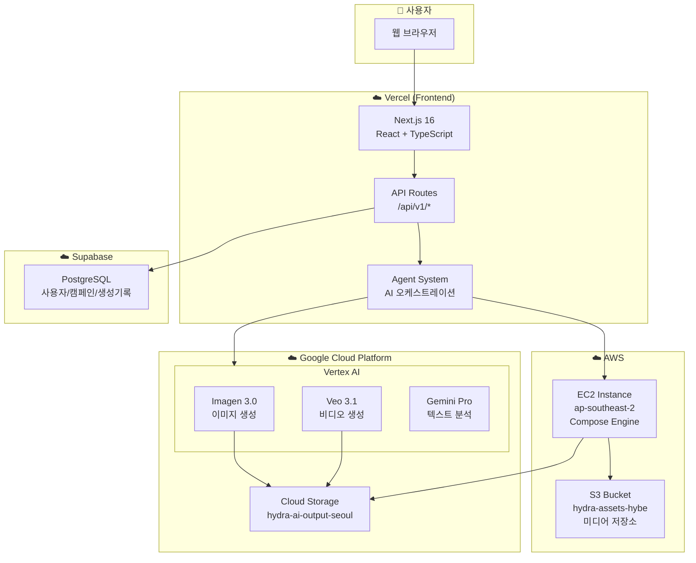

### 2.2 컴포넌트 구성

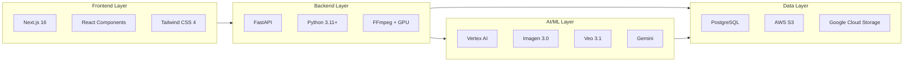

---

## 3. 컴포넌트 상세

### 3.1 기술 스택 매트릭스

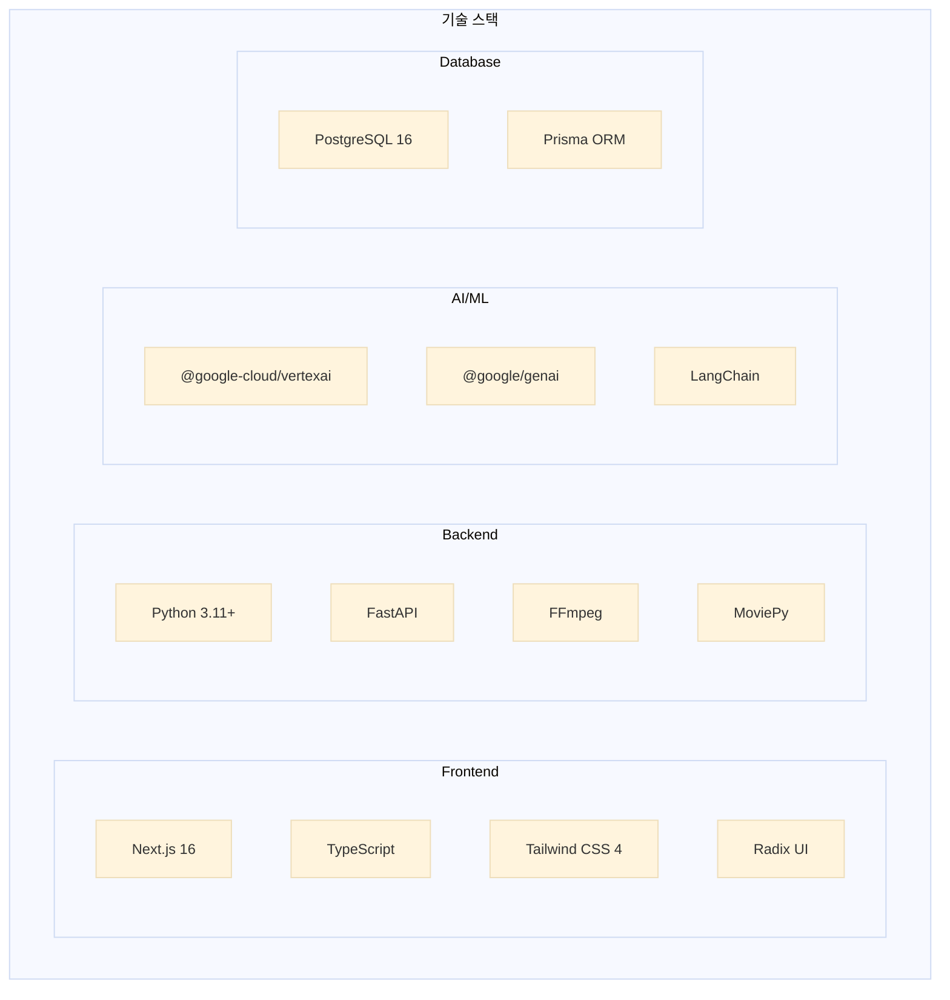

### 3.2 호스팅 위치 및 역할

| 컴포넌트 | 기술 스택 | 호스팅 위치 | 리전 | 역할 |
|---------|----------|------------|------|------|
| **Frontend** | Next.js 16, React | Vercel | Global Edge | UI, API Gateway |
| **Backend** | Python, FastAPI | AWS EC2 | ap-southeast-2 | 비디오 렌더링 |
| **AI 서비스** | Vertex AI | GCP | us-central1 | AI 생성 |
| **Database** | PostgreSQL | Supabase | ap-south-1 | 데이터 저장 |
| **Storage** | S3, GCS | AWS/GCP | ap-southeast-2 | 미디어 파일 |

---

## 4. AI 서비스 구조

### 4.1 AI API 호출 구조

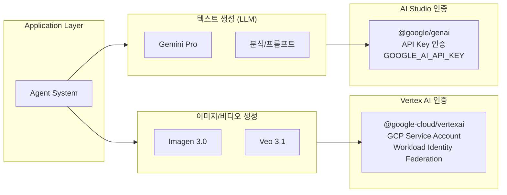

### 4.2 AI 서비스 상세

| 서비스 | 모델 | 용도 | 인증 방식 | 패키지 |
|--------|------|------|----------|--------|
| **이미지 생성** | Imagen 3.0 | 마케팅 이미지 | GCP Service Account | `@google-cloud/vertexai` |
| **비디오 생성** | Veo 3.1 | 숏폼 비디오 | GCP Service Account | `@google-cloud/vertexai` |
| **텍스트 분석** | Gemini Pro | 스크립트, 분석 | API Key | `@google/genai` |

---

## 5. 데이터 흐름

### 5.1 비디오 생성 워크플로우

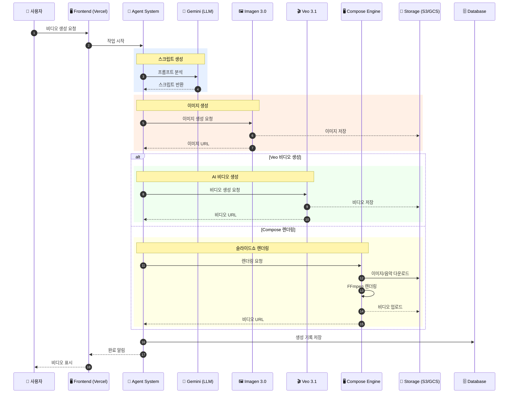

### 5.2 Fast-Cut 워크플로우

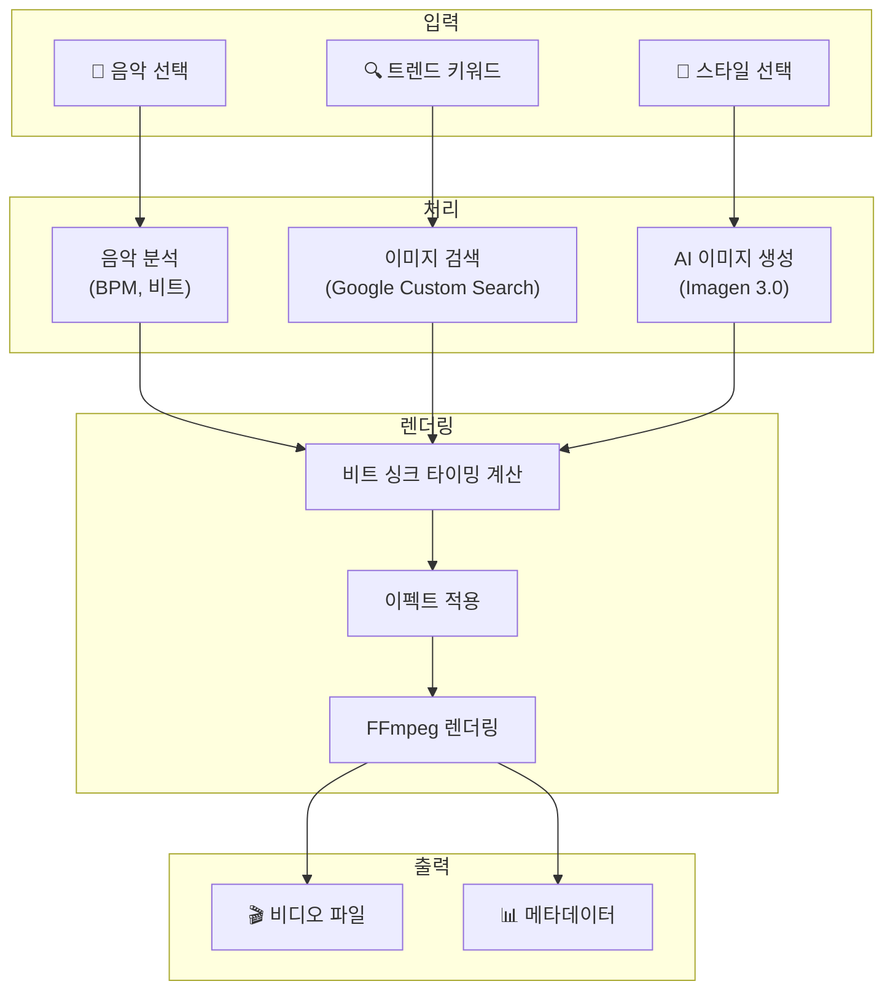

---

## 6. API 구조

### 6.1 API 엔드포인트 구조

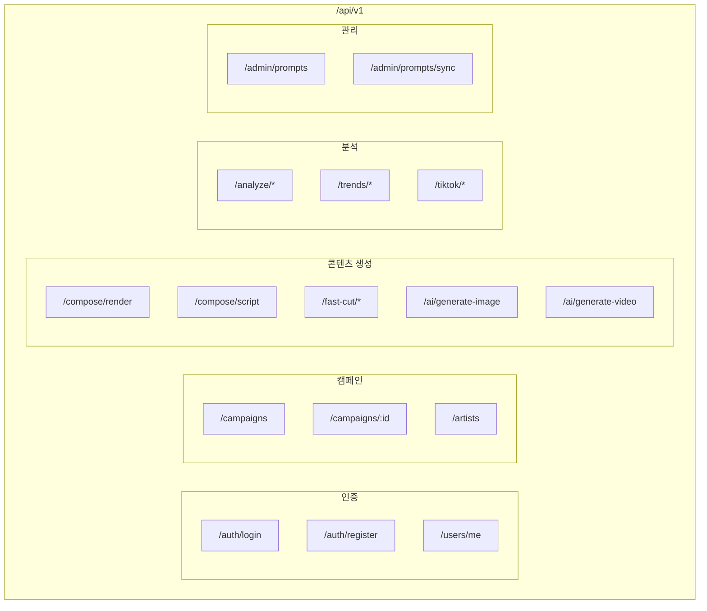

---

## 7. 현재 인프라 요약

### 7.1 인프라 구성 현황

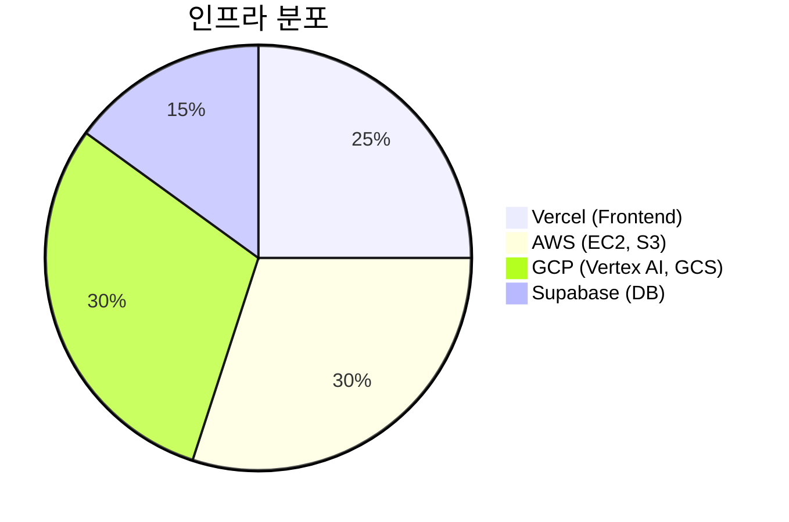

### 7.2 외부 서비스 의존성

| 카테고리 | 서비스 | 용도 | 위치 |
|---------|--------|------|------|
| **Compute** | Vercel | Frontend 호스팅 | Global |
| **Compute** | AWS EC2 | Backend 서버 | ap-southeast-2 |
| **AI** | Vertex AI | AI 생성 | us-central1 |
| **Storage** | AWS S3 | 미디어 저장 | ap-southeast-2 |
| **Storage** | GCS | AI 출력 저장 | asia-northeast3 |
| **Database** | Supabase | PostgreSQL | ap-south-1 |
| **Auth** | Supabase Auth | 사용자 인증 | - |

---

## 8. 질문에 대한 답변

### Q1: 단순히 외부에서 API만 호출하여 사용하는 구조인가?

**답변**: **혼합 구조**입니다.

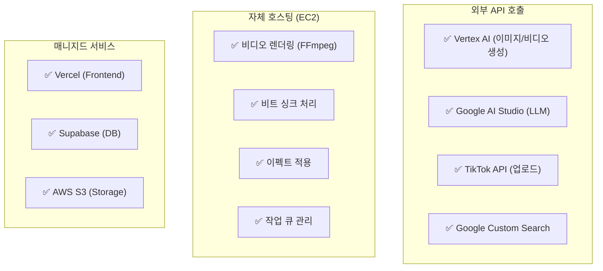

### Q2: 전체 인프라를 HYBE GCP 내에 구성할 예정인가?

**현재 상태**: HYBE GCP에 구성되어 있지 **않음**

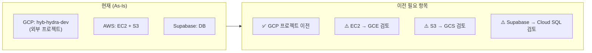

---

## 9. HYBE GCP 이전 시 구성 (To-Be)

### 9.1 목표 아키텍처

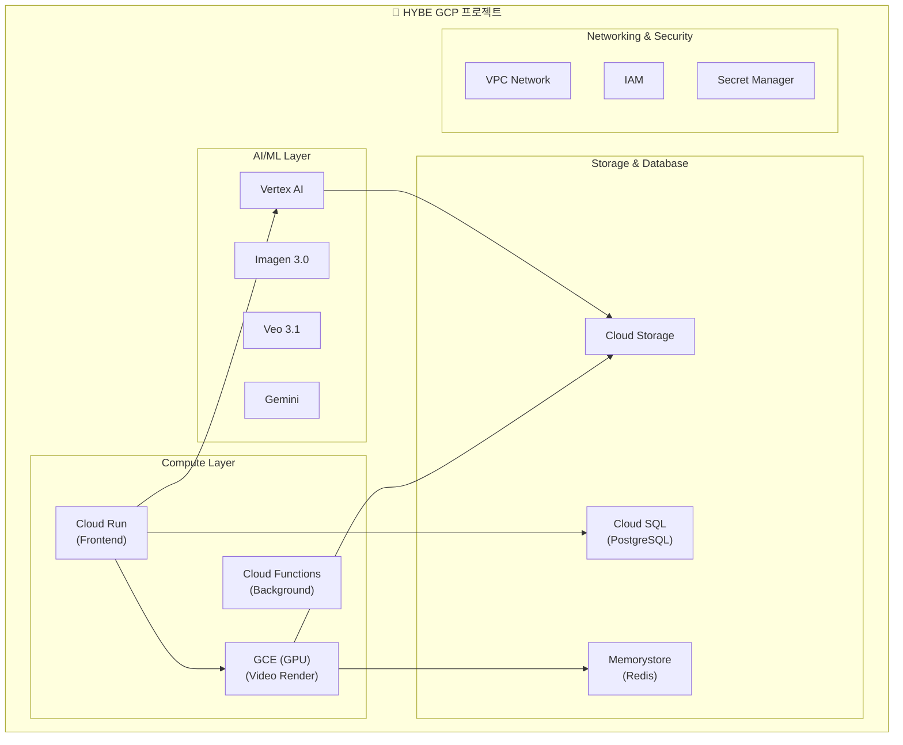

### 9.2 마이그레이션 대상

| 현재 리소스 | 현재 위치 | 이전 대상 | 우선순위 |
|------------|----------|----------|---------|
| GCP 프로젝트 | hyb-hydra-dev | HYBE GCP | 🔴 높음 |
| Vertex AI | 외부 GCP | HYBE GCP | 🔴 높음 |
| EC2 서버 | AWS Sydney | GCE | 🟡 중간 |
| S3 Storage | AWS | GCS | 🟡 중간 |
| Database | Supabase | Cloud SQL | 🟢 낮음 |

---

## 10. 보안 고려사항

### 10.1 현재 인증 체계

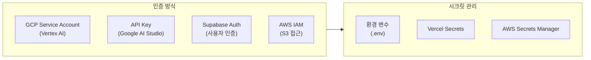

### 10.2 권한 및 접근 제어

| 리소스 | 접근 방식 | 권한 수준 |
|--------|----------|----------|
| Vertex AI | Service Account + WIF | aiplatform.user |
| AWS S3 | IAM Access Key | s3:GetObject, s3:PutObject |
| Supabase | API Key + JWT | Row Level Security |
| EC2 | SSH Key | Admin (인스턴스 내) |

---

## 11. 참고 문서

| 문서 | 경로 | 설명 |
|------|------|------|
| 배포 아키텍처 상세 | `docs/DEPLOYMENT_ARCHITECTURE.md` | 배포 프로세스 상세 |
| Compose Engine 구현 | `docs/COMPOSE_ENGINE_IMPLEMENTATION.md` | 비디오 렌더링 엔진 |
| 시스템 분석 보고서 | `docs/SYSTEM_ANALYSIS_REPORT.md` | 시스템 전체 분석 |
| Deep Analysis 스펙 | `docs/DEEP_ANALYSIS_BACKEND_SPEC.md` | AI 분석 기능 명세 |

---

## 12. 연락처

| 역할 | 담당 | 연락처 |
|------|------|--------|
| 기술 총괄 | - | - |
| 인프라 담당 | - | - |
| AI/ML 담당 | - | - |

---

*본 문서는 HYBE 내부 검토용으로 작성되었습니다.*
